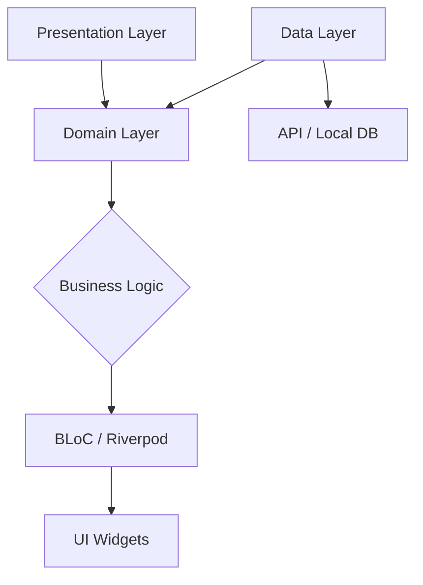

# 
🚀 Denzil Muchangi

  

  
  
  

---

### 🏛️ Architectural Positioning
> "Scaling Flutter apps isn't just about widgets; it's about resilient architecture and measurable performance trade-offs."

I am a results-driven **Senior Cross-Platform Developer** with **5+ years** of experience specializing in high-performance mobile, web, and cloud ecosystems. I bridge the gap between complex business requirements and scalable technical implementation.

- 📱 **25+ Applications** deployed across App Store & Play Store.
- ⚡ **60% Increase** in development velocity through modular architecture.
- 🚀 **40% Performance optimization** achieved via custom rendering and state management strategies.
- 🛠️ **Lead & Mentor** of high-performing engineering teams.

---

### 📊 Engineering Metrics

  
  

---

### 🛠️ Strategic Tech Stack

<b>Mobile & Cross-Platform</b>

  
  
  
  
  

<b>Backend & Cloud</b>

  
  
  
  
  

<b>Tools & Databases</b>

  
  
  
  

---

### 🏗️ Preferred Flutter Architecture
I advocate for a **Feature-First Clean Architecture** to ensure testability and team scalability.

---

### 🌟 Business Impact & Achievements

| Impact Area | Performance | Strategic Outcome |
| :--- | :--- | :--- |
| **Enterprise Scalability** | 25+ Prod Apps | Successfully handled 100k+ concurrent users. |
| **Operational Efficiency** | 60% Faster Dev | Implemented CI/CD pipelines and modular UI kits. |
| **System Reliability** | 95%+ Coverage | Zero critical failures in major production releases. |
| **Cost Optimization** | 30% Cloud Savings | Refactored Azure/AWS serverless functions. |

---

### 🏆 Verified GitHub Recognition

  

---

### ✍️ Currently Focused On
- 🚀 **Flutter for Wasm**: Optimizing performance for the next generation of web apps.
- 🤖 **On-Device AI**: Integrating Gemini and TensorFlow Lite for privacy-first mobile ML.
- 🏗️ **Macro-Driven Dart**: Exploring the future of code generation in Dart 3.x.

---

### 📫 Let's Connect
- **Location:** Nairobi, Kenya (Available for Remote/Hybrid worldwide)
- **Roles:** Senior Developer, Flutter Lead, Architecture Consultant.
- **Direct:** [njagidenzil@gmail.com](mailto:njagidenzil@gmail.com)

  

